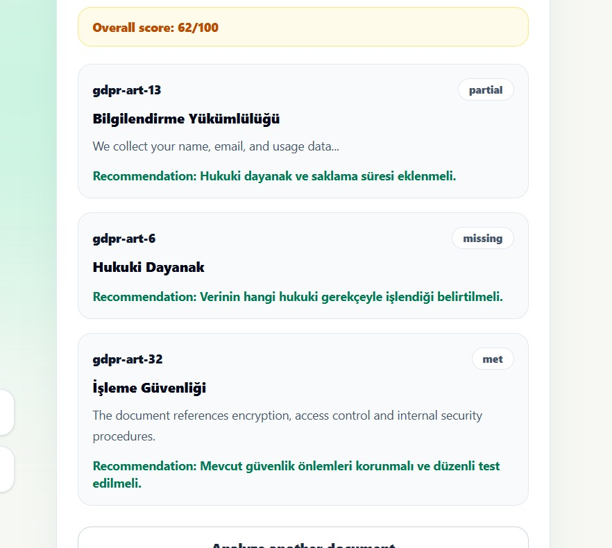

# Traceon-AI

## Takım İsmi
Governers
## Takım Rolleri
- Ahmet Faruk Bilgin — Product Owner
- Abdullah Önder Aksu — Scrum Master, Frontend
- Eylül Zengin — Developer (Backend)
- Efnan Demircan — Developer (Bilgi Tabanı & Test)
- Ezgi Yıldırım — Developer (Bilgi Tabanı & Test)

## Ürün İsmi
Traceon-AI

## Ürün Açıklaması
Şirketlerin gizlilik politikaları, aydınlatma metinleri ve veri işleme sözleşmeleri gibi kurumsal dokümanlarını, veri koruma regülasyonlarına (GDPR/KVKK) uyumluluk açısından saniyeler içinde analiz eden yapay zeka ve RAG (Retrieval-Augmented Generation) tabanlı bir ön-uyum değerlendirme asistanıdır. Hukuk ve iç denetim ekiplerinin yüzlerce sayfalık dokümanları manuel olarak Excel üzerinde inceleme yükünü ortadan kaldırarak ön denetim süreçlerini dakikalara indirir, her sonucu kaynağıyla birlikte gösterir.

## Ürün Özellikleri

- **Esnek Mevzuat Altyapısı:** GDPR ve KVKK için ayrı kod yazılmasını gerektirmeyen, seçilen mevzuata göre veri dosyasını okuyan esnek motor.  
- **Çoklu Dosya Desteği:** PDF ve DOCX formatındaki kurumsal dökümanların sisteme yüklenmesi ve metinlerin otomatik ayrıştırılması.  
- **Akıllı Vektör Eşleştirme (RAG):** Döküman metinlerinin parçalara bölünerek resmi kanun maddeleriyle anlamsal olarak eşleştirilmesi.  
- **Uyum Skoru:** Yapay zeka analiziyle dökümanın mevzuata genel uyumluluk oranını yüzde bazında gösteren metrik.
- **Kanıt Gösterimi (Açıklanabilir AI):** Yapay zekanın her tespiti için döküman içinden alıntı cümle ve sayfa numarasıyla kanıt sunması.  
- **Çözüm Önerileri:** Tespit edilen eksik maddeler için yapay zeka tarafından otomatik üretilen düzeltici aksiyon önerileri.  
- **PDF Raporu:** Dashboard üzerindeki analiz sonuçlarının ve önerilerin kurumsal bir PDF raporu olarak indirilebilmesi. (Opsiyonel)

## Hedef Kitle
KOBİ'ler, uyum danışmanları, iç denetim ve bilgi güvenliği ekipleri

## Product Backlog
https://github.com/orgs/Traceon-AI/projects/1
---

# Sprint 1
- **Backlog düzeni ve Story seçimleri**: Görev dağıtım mantığı için [tasks.md](./docs/tasks.md) — görevler rol ve müsaitlik durumuna göre dağıtıldı, detaylar sprint board'da.
- **Daily Scrum**: [Sprint 1 Daily Scrum Kayıtları](docs/sprint-1-daily-scrum.md)
- **Sprint board update**: https://github.com/orgs/Traceon-AI/projects/1 (For Eylül)
- **Ürün Durumu**: [Ürün Durumu Raporu](./docs/sprint-1-product-status.md)
  

- **Sprint Review**: [Sprint 1 Review](./docs/sprint-1-review.md)
- **Sprint Retrospective:** [Sprint 1 Retrospective](./docs/sprint-1-retrospective.md)

---

# Sprint 2

---

# Sprint 3

---
